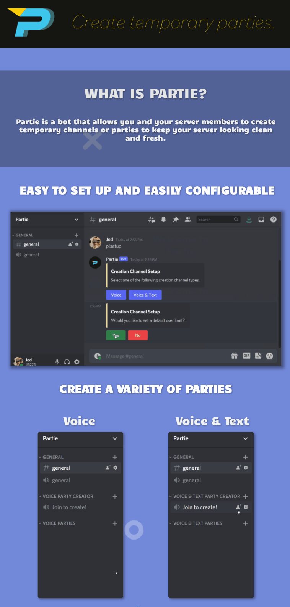

# DEPRECATED
# Partie

## Overview
Partie is a bot that allows you and your server members to create temporary channels or parties to keep your server looking clean and fresh. With a variety of party types to choose from you can find exactly what you're looking for!

## Commands
### General Commands
|  Command  |             Description             |
|:---------:|:-----------------------------------:|
| p!help    | Gets bot commands.                  |
| p!support | Get the link to the support server. |
| p!vote    | Get the link to the vote page.      |

### Party Commands
|        Command       |                   Description                   |
|:--------------------:|:-----------------------------------------------:|
| p!access             | Shows who has access to your current party.     |
| p!add <@mention>     | Add a user to your party.                       |
| p!kick <@mention>    | Kick a user from your party.                    |
| p!limit <#>          | Limit the number of users allowed in the party. |
| p!neutral <@mention> | Resets a user's permissions for the party.      |
| p!private            | Sets the party to private.                      |
| p!public             | Sets the party to public.                       |
| p!remove <@mention>  | Removes a user from the party.                  |

### Server Admin Commands
|         Command         |                          Description                          |
|:-----------------------:|:-------------------------------------------------------------:|
| p!claim                 | Claim party leadership if you are in the party voice channel. |
| p!config                | Configure me to your preferences.                             |
| p!edit                  | Edit existing creation channels' party settings.              |
| p!setup                 | Setup party creation channels.                                |
| p!toggle <command_name> | Toggle commands on or off for your server.                    |
| p!private               | Sets the party to private.                                    |
| p!public                | Sets the party to public.                                     |
| p!remove <@mention>     | Removes a user from the party.                                |

=======

When obtaining a new token from Discord Developer Portal, copy and paste it into the second index of the token array in the config.json file. 
I know it makes no sense but I had my reasons.
If using PM2, just run pm2 start index.js
